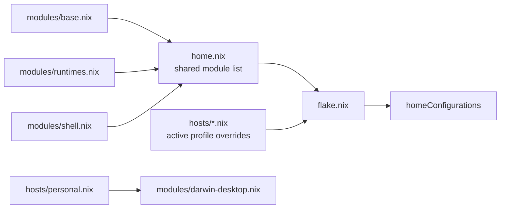

<p align="center">
  <a href="flake.nix"></a>
  <a href="https://github.com/nix-community/home-manager"></a>
  
  
</p>

<h1 align="center">homie</h1>

<p align="center">
  <b>One command rebuilds my whole shell environment — packages, dotfiles, shell,<br>
  and pinned language runtimes — the same way on macOS and WSL2.</b>
</p>

<p align="center">
  <a href="#what-this-is">What</a> ·
  <a href="#how-it-fits-together">Architecture</a> ·
  <a href="#fresh-machine">Fresh machine</a> ·
  <a href="#daily-use">Daily use</a> ·
  <a href="#layout">Layout</a> ·
  <a href="#rules-of-the-house">Rules</a>
</p>

<p align="center">
  <i>Personal dotfiles as a <a href="flake.nix">Nix flake</a> + <a href="https://github.com/nix-community/home-manager">Home Manager</a> — shared modules in <code>modules/</code>, per-machine overrides in <code>hosts/</code>.</i>
</p>

---

## What this is

My machine setup, declarative and reproducible. Instead of shell scripts and
hand-installed tools that drift across machines, Nix owns CLI packages and dotfile
deployment while [mise](https://mise.jdx.dev) owns pinned language runtimes. `make switch`
materializes the selected Home Manager profile.

| Profile        | Machine      | System         |
| -------------- | ------------ | -------------- |
| `zaki`         | personal mac | aarch64-darwin |
| `zaki@cekat`   | work mac     | aarch64-darwin |
| `zaki@windows` | WSL2         | x86_64-linux   |

Former ByteDance and Tokopedia configuration fragments remain publicly available under
[`history/hosts/`](history/hosts/), but they are inactive records rather than supported profiles.

## How it fits together



`flake.nix` combines the shared module list from `home.nix` with one active host module.
The personal profile explicitly imports the skhd and OmniWM desktop lifecycle; operating
system detection alone does not select personal desktop behavior. The flake also exposes
locked Home Manager and mise apps used by bootstrap and the Make targets.

`config/` mirrors paths below `~/.config`. This is why `config/starship.toml` is flat:
Starship reads `~/.config/starship.toml`, while Helix and Zed read files inside their own
directories.

## Fresh machine

One command — no Git, Nix, or SSH key needed beforehand:

```sh
curl -fsSL https://raw.githubusercontent.com/nyelonong/homie/main/bootstrap.sh | sh
```

It installs Nix, clones this public repository to `~/homie`, generates an SSH key for
later pushes, applies the locked Home Manager configuration, and installs the pinned
language runtimes. On rerun, the checkout must be the expected repository on a clean
`main`; bootstrap fetches and fast-forwards it without discarding work or rewriting history.

`PROFILE` overrides the compatible OS default (`zaki` on macOS, `zaki@windows` on WSL2).
Set it on `sh`, not `curl`:

```sh
curl -fsSL https://raw.githubusercontent.com/nyelonong/homie/main/bootstrap.sh | PROFILE=zaki sh
```

Afterwards, restart the shell.

## Daily use

```sh
make switch    # apply config through the locked Home Manager (PROFILE=zaki default)
make update    # bump flake inputs, then apply
make fmt       # format every Nix file and validate OmniWM settings
make check     # run format, shell, bootstrap, profile-boundary, and OmniWM checks
make help      # list all targets
```

OmniWM owns and rewrites its live settings file. `make omniwm-deploy` stops OmniWM,
pushes the repository seed, and restarts it; `make omniwm-harvest` pulls GUI changes
back for review before committing.

## Layout

```text
flake.nix            locked inputs, apps, and active homeConfigurations
home.nix             ordered list of shared Home Manager modules
modules/base.nix     packages, paths, environment, fonts, static dotfiles
modules/runtimes.nix mise and direnv configuration
modules/shell.nix    shared Zsh, aliases, prompt, and provider wrappers
modules/darwin-desktop.nix
                     personal skhd service and OmniWM activation lifecycle
hosts/               active per-machine identity, packages, and overrides
history/hosts/       inactive former-employer configuration records
config/              mirrors ~/.config (starship, helix, Zed)
apps/omniwm/         seed for app-owned writable settings
scripts/, tests/     validation and behavior regressions
.gitconfig           → ~/.gitconfig
.skhdrc              → ~/.skhdrc for the personal profile
bootstrap.sh         validated fresh-machine and rerun setup
```

## Rules of the house

- **Edit files in this repository, not in `~`.** Managed files are read-only store
  symlinks and are replaced on `make switch`. `~/.zshrc.local` is the ignored escape hatch
  for unshared machine-specific shell additions.
- **New CLI tools go in `modules/base.nix`, not Brew.** Language runtimes are the exception:
  mise owns their pins in `modules/runtimes.nix`, preserving per-project overrides through
  `mise.toml` or `.tool-versions`.
- **`config/` follows deployed XDG paths, not a folder-per-application convention.** Add a
  corresponding `home.file` mapping in `modules/base.nix` for each new managed file.
- **Brew owns macOS GUI applications and anything not suited to Nix.** Nix may still own
  their service or deployment configuration.
- **Apps that rewrite their settings live in `apps/`, not `config/`.** Their live file stays
  writable and app-owned; the repository copy is a seed managed through explicit deploy and
  harvest commands.
