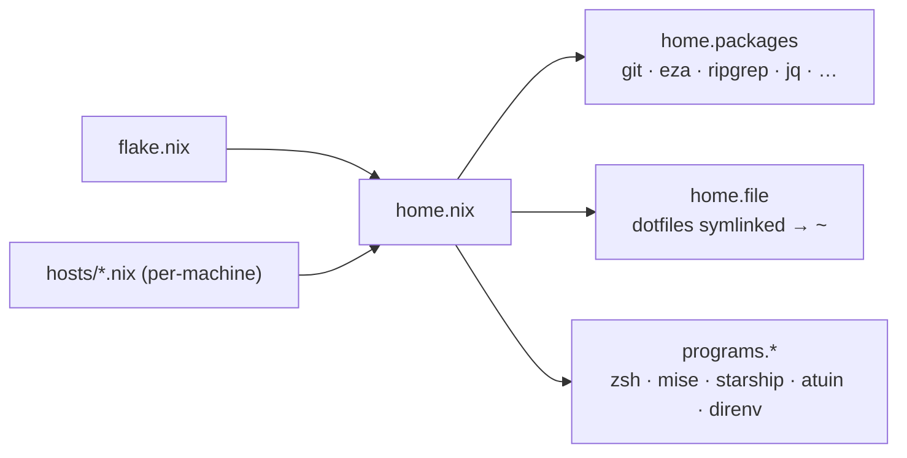

<p align="center">
  <a href="flake.nix"></a>
  <a href="https://github.com/nix-community/home-manager"></a>
  
  
</p>

<h1 align="center">homie</h1>

<p align="center">
  <b>One command rebuilds my whole shell environment — packages, dotfiles, shell,<br>
  and pinned language runtimes — the same way on macOS and WSL2.</b>
</p>

<p align="center">
  <a href="#what-this-is">What</a> ·
  <a href="#how-it-fits-together">Architecture</a> ·
  <a href="#fresh-machine">Fresh machine</a> ·
  <a href="#daily-use">Daily use</a> ·
  <a href="#layout">Layout</a> ·
  <a href="#rules-of-the-house">Rules</a>
</p>

<p align="center">
  <i>Personal dotfiles as a <a href="flake.nix">Nix flake</a> + <a href="https://github.com/nix-community/home-manager">home-manager</a> — one <code>home.nix</code> module, per-machine overrides in <code>hosts/</code>.</i>
</p>

---

## What this is

My machine setup, declarative and reproducible. Instead of a pile of shell scripts
and hand-installed tools that drift apart across machines, everything — CLI packages,
dotfile symlinks, shell config, pinned runtimes — is one Nix expression. A single
`home-manager switch` materializes it, and it lands the same on my Mac and my WSL2 box.
There is no application build; validation checks configuration and materializes the home environment.

| Profile        | Machine      | System         |
| -------------- | ------------ | -------------- |
| `zaki`         | personal mac | aarch64-darwin |
| `zaki@cekat`   | work mac     | aarch64-darwin |
| `zaki@windows` | WSL2         | x86_64-linux   |

## How it fits together



`flake.nix` exposes one home configuration per profile; each pairs `home.nix` (the shared
module) with a small `hosts/` file for the per-machine username and home directory. Language
runtimes are the one thing Nix does **not** own — [mise](https://mise.jdx.dev) manages
them so each project can pin its own versions.

## Fresh machine

One command — no git, nix, or SSH key needed beforehand:

```sh
curl -fsSL https://raw.githubusercontent.com/nyelonong/homie/main/bootstrap.sh | sh
```

It installs Nix (Determinate), clones this repo to `~/homie` over HTTPS (read-only, no auth —
it's public), generates an SSH key for pushing back later, applies the right profile, and
installs the pinned language runtimes. Re-runnable — steps skip or harmlessly re-apply.

`PROFILE` overrides the OS-based default (`zaki` on macOS, `zaki@windows` on WSL2). Set it on
`sh` — the right side of the pipe, not `curl`:

```sh
curl -fsSL https://raw.githubusercontent.com/nyelonong/homie/main/bootstrap.sh | PROFILE=zaki sh
```

Afterwards, restart your shell.

## Daily use

```sh
make switch    # apply config after editing (PROFILE=zaki default)
make update    # bump flake inputs, then apply
make fmt       # format Nix files and validate OmniWM settings
make check     # run formatting, shell, and OmniWM checks
make help      # list all targets
```

Mac desktop extras: OmniWM's settings file is owned by the app itself, so it
gets two extra targets — `make omniwm-deploy` pushes the repo seed to the live
file (overwrites GUI edits), `make omniwm-harvest` pulls GUI changes back into
the repo for review before committing.

## Layout

```
flake.nix            inputs + one homeConfiguration per profile
home.nix             the module: packages, symlinks, shell, programs,
                     mac launchd agent (skhd), activation hooks
hosts/               per-machine username/homeDirectory overrides
config/              → ~/.config (starship, helix, skhd keymap)
apps/                seeds for apps that rewrite their own settings
                     (omniwm/) — live file stays app-owned; deploy/harvest
scripts/, tests/      validation and deployment regression checks
.gitconfig           → symlinked into ~; Zsh is generated by home-manager
bootstrap.sh         fresh-machine setup (nix + home-manager only)
```

## Rules of the house

- **Edit files in this repo, not in `~`.** Home versions are read-only symlinks into
  `/nix/store`, overwritten on every `make switch`. For machine-specific Zsh additions,
  use `~/.zshrc.local`; it is sourced after the managed configuration and is ignored by Git.
- **New CLI tools go in `home.packages`** (`home.nix`), not brew. Language runtimes are the
  exception — [mise](https://mise.jdx.dev) owns them, pinned under
  `programs.mise.globalConfig.tools`. To bump one: edit that, then `make switch && mise install`.
  Per-project overrides still work — drop a `mise.toml` or `.tool-versions` in the project.
- **Brew owns mac GUI apps and anything unpackagable** — currently Karabiner-Elements and
  OmniWM. Nix manages their daemons and configs where possible; the app binaries stay casks.
- **Apps that rewrite their own settings live in `apps/`, not `config/`.** Their live file is
  plain and app-owned; the repo copy is a seed pushed with `make <tool>-deploy` and synced back
  with `make <tool>-harvest` (then commit). Everything else is a read-only store symlink.
